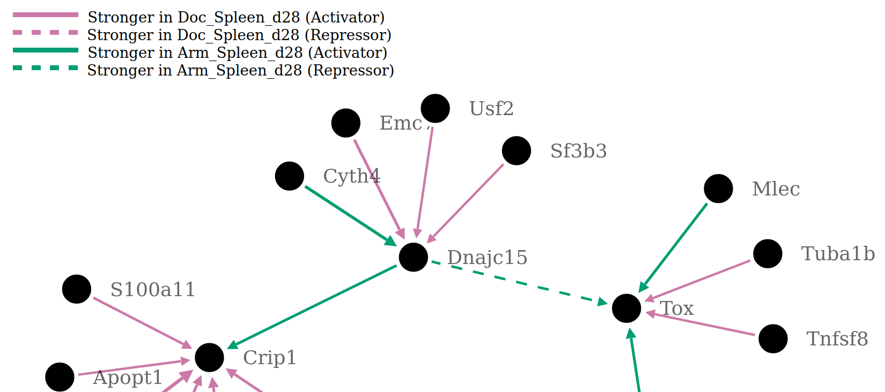

# Inter-Net Xplorer
## Installation Instruction 
1) Install nextflow with the following command (can be moved to any directory you want): (requires Java version 11 or higher)   
```
curl -fsSL get.nextflow.io | bash
```
2) Clone this repository and navigate to it:
```
git clone git@github.com:bionetslab/boostdiff-nextflow.git && cd boostdiff-nextflow
```
2) Install the neccesary conda environment (this will take time). This can be sped up dramatically by using mamba instead of conda:  
```
mamba env create --prefix=$(pwd)/environment --file=./environment.yml
conda activate ./environment
```   
3) Clone the `boostdiff_inference` tool (https://github.com/gihannagalindez/boostdiff_inference):
```
git clone git@github.com:gihannagalindez/boostdiff_inference.git && cd boostdiff_inference
pip install .
cd ..
```
Now you are set to run Inter-Net Xplorer!

## Running Inter-Net Xplorer
This section describes piece by piece how to run this pipeline. Examples will be provided along the way and at the end of this section.
### 1) Running the nextflow pipeline
To run the the nextflow pipeline use the following command. 
```
${path_to_nextflow}/nextflow run main.nf --tools=${tools_to_run} --mode=${data_mode} --input=${data_input}
```

### 2) Choosing ${tools_to_run} for GRN and DGRN inference
The `--tools` parameter needs to be set to identify the tools that are used in the pipeline. Current available tools are:
* DGRN inference tools:
  * `boostdiff` (https://github.com/gihannagalindez/boostdiff_inference)
* GRN inference tools:
  * `grnboost2` (https://academic.oup.com/bioinformatics/article/35/12/2159/5184284)

The `--tools` parameter needs to be set as comma separated list. For example, if you want to use boostdiff and grnboost2 you need to set `--tools=boostdiff,grnboost2`   

### 3) Choosing the ${data_mode}
The `--mode` parameter needs to be set to identify the data that you are using. Currently availabe modes are `seurat` and `tsv`.

### 4) Specifying the ${data_input} file 

#### 4.1) Mode is set to "seurat"
Use the `--input` parameter to set the path to the seurat file

#### 4.2) Mode is set to "tsv"
Use the `--input_file1` parameter to set the path to the first tsv file. <br />
Use the `--input_file2` parameter to set the path to the second tsv file. <br />
If you are only using GRN inference tools, specifying one input is enough. <br />
The first column of the tsv files **has to be named** `Gene` and contain all gene names. The following columns represent the samples. 

### 5) Writing a configuration file

#### 5.1) Mode is set to "seurat"
The configuration file is a yaml file that contains the configuration for the data that you are using to select the correct cells
1) Create a config.yaml file
2) The structure for the config file is explained in the example config "example_config.yaml"
3) Set the parameter `-params-file` to the path of your config file 

#### 5.2) Mode is set to "tsv"
You do not need to write a configuration file. However, you need to set an identifier for the anaylsis with the `--comparison_id` parameter. Set this to something identifiable and unique because the folder with the specifc analysis results will be named after this.

### 6) Working example of running the pipeline:
You only need to set the ${path_to_nextflow} specific to your system to run the following command and test the pipeline. (Needs to be run inside the project directory)
```
${path_to_nextflow}/nextflow run main.nf --tools=boostdiff,grnboost2 --mode=tsv --input_file1=$(pwd)/example_file1.tsv --input_file2=$(pwd)/example_file2.tsv --comparison_id=example_analysis
```

## Structure of the pipeline:
The pipeline is split into 3 steps:
1) Data loading
2) Running tools
3) Analysis
Every step has concretely defined inputs and outputs.
### 1) Data loading:
Inputs:
  * tools: The tools used inside the pipeline defined via the `--tools` parameter
Output:
  * data: Nextflow channel with the structure [comparison_id, [file_1.tsv, file_2.tsv]]
Function:
  This step loads the data and performs some basic checks
### 2) Running Tools

## Adding a new data loading module:
Suppose you want to add a new data loading module . This


<!-- # Settings of the pipeline
Standard settings of this pipeline:
- Data:
  - Cluster 1, 2
  - Armstrong vs Docile, Spleen, day 28
  - Armstrong vs Docile, Liver, day 10
- No. total runs of boostdiff: 10
- Settings for individual boostdiff runs:
  - no. estimators: 50
  - no. features: 1500
  - no. subsamples: 30
  - no. processes: 8
- Settings for filtering the aggregated results:
  - Top n nodes: 20 (most differntially expressed target genes between the two conditions)
  - Top n edges: 100 (highest ranking interactions between remaining genes)

# Pipeline workflow
1) Read in data
2) Run boostdiff for a no. total runs
3) Aggregate results by creating the union of all runs and average over the scores
4) Filter aggregated results based on the settings
5) Check regulatory interaction of every edge based on small linear model that is fitted on every edge 
6) Create output .html file

# Interpreting the results
Outputs:
  - This pipeline puts out a .txt file containing the data of the inferred differntial GRN
  - This pipeline puts out a .html file containing the graph representation of the inferred differential GRN (image shows part of such a differential GRN):
    - Nodes: represent the genes (annotated with the gene name)
    - Edges: 
      - 2 colours representing condition 1,2 (pink and green, see legend)
      - 4 possible edges:
        - pink fully drawn arrow  (up regulatory interaction that is stronger in condition 1)
        - pink dashed arrow       (down regulatory interaction that is stronger in condition 1)
        - green fully drawn arrow (up regulatory interaction that is stronger in condition 2)
        - green dashed arrow      (down regulatory interaction that is stronger in condition 2)



 -->
