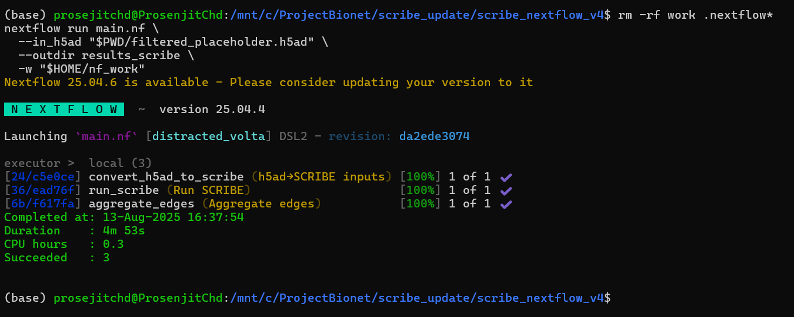

# 🧬 SCRIBE Gene Regulatory Network Inference Pipeline (Nextflow)

This project implements **SCRIBE**-style gene regulatory network (GRN) inference for single-cell RNA-seq data using a **Nextflow DSL2 pipeline**.  
It accepts `.h5ad` as input and produces a ranked list of regulator→target edges plus a normalized adjacency.

The pipeline follows the spirit of the [Beeline GRN Benchmarking Suite](https://github.com/Murali-group/Beeline) and provides:

- a native **R backend** (if `Rscript` is available), and
- a built-in **Python fallback** (no R required).

---

## 📁 Project Structure

```

scribe_nextflow_v4/
├── main.nf # Main Nextflow pipeline (R backend + Python fallback)
├── nextflow\.config # Config (resources + container optional)
├── README.md # This file
├── modules/
│ └── grn/
│ └── scribe/
│ ├── h5ad_to_scribe_inputs.py # Read .h5ad -> expr.csv / genes.txt / pseudotime.csv
│ ├── run_scribe.R # SCRIBE core (preferred if Rscript exists)
│ ├── averageA.R # Average/normalize edge weights
│ └── aggregate_edges.py # Beeline-style final ranking
└── filtered_placeholder.h5ad # (example input; optional)

```

---

## 🔧 Setup Instructions

### 🧬 Prerequisites (without container)

If running **without container**, install manually:

- **Nextflow** ≥ 25.x
- **Python 3.9+** with:
  - `anndata`, `h5py`, `numpy`, `pandas`, `scipy`
- **(Optional) R** with `Rscript` and:
  - `optparse`, `data.table`, `matrixStats`, `tidyverse`

### 📦 Running with Container (recommended)

A prebuilt container image (created via [Seqera Containers](https://seqera.io/containers/)) is available.
This ensures all Python + R dependencies are consistent.

The container image is referenced in `nextflow.config` like:

```groovy
process {
  container = 'community.wave.seqera.io/library/anndata_h5py_numpy_pandas:<build_id>'
}
```

> 🔎 Why not hardcode in `main.nf`?
> Because `main.nf` is algorithm-agnostic — dependencies are managed via config.
> If the container build fails or mismatches occur, that is an **external dependency issue** (not the pipeline logic).
> In such cases, check the `env.yml` used for container creation and rebuild via Seqera.

---

## 🚀 Run the SCRIBE Pipeline

### ▶️ Option 1: Run without container (local dependencies)

```bash
nextflow run main.nf \
  --in_h5ad "$PWD/filtered_placeholder.h5ad" \
  --outdir results_scribe \
  -w "$HOME/nf_work"
```

### ▶️ Option 2: Run with container (reproducible)

```bash
nextflow run main.nf \
  --in_h5ad "$PWD/filtered_placeholder.h5ad" \
  --outdir results_scribe \
  -w "$HOME/nf_work" \
  -with-docker
```

(or `-with-singularity` on HPC systems)

---

## 📤 Output Files

- **`results/edges.tsv`**
  Raw SCRIBE edges with columns:
  `regulator  target  score`
  Higher `score` ⇒ stronger inferred regulation.

- **`results/A_averaged.tsv`**
  Normalized per-pair weights with columns:
  `regulator  target  weight` (0–1).
  Useful as a final adjacency for network tools (e.g., Cytoscape).

- **`final/scribe_ranked_edges.tsv`**
  Beeline-style final ranked edges aggregated for benchmarking.

> 🔎 Rule of thumb:
> Use `edges.tsv` for full ranking/analysis; use `A_averaged.tsv` for a one-score-per-edge network.

---

## 🧪 Backend Behavior

- If **`Rscript` is available**, the pipeline runs native SCRIBE:

  - `run_scribe.R`
  - `averageA.R`

- If **`Rscript` is **NOT** found**, the pipeline uses a **Python fallback** to produce:

  - `results/edges.tsv`
  - `results/A_averaged.tsv`

Thus, the pipeline always produces usable results.

---

## 📊 Quick Visualization

Load `A_averaged.tsv` into Cytoscape, Gephi, or igraph for GRN visualization.
Use **`weight`** as the edge attribute.

---

## 🖼️ Result Example

After successfully running the project, you should see a screen like this:



---

## 📚 References

- **Qiu, Ke, et al.**
  _Inferring Causal Gene Regulatory Networks from Time-Stamped Single-Cell Transcriptome Data._ (SCRIBE methodology)

- **Beeline Benchmark Suite**
  [https://github.com/Murali-group/Beeline](https://github.com/Murali-group/Beeline)

---

## 👨‍💻 Author

**Prosenjit Chowdhury**
M.Sc. Artificial Intelligence – FAU Erlangen-Nürnberg
Working Student @ SAP ERP PCX
Erlangen, Germany
🔗 GitHub: [@prosenjit-chowdhury](https://github.com/prosenjit-chowdhury)

---
